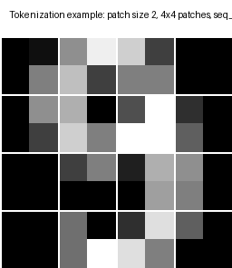
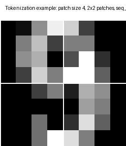
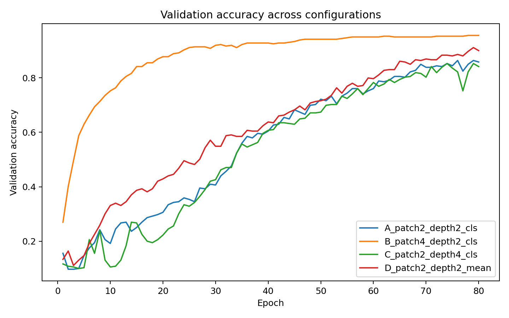
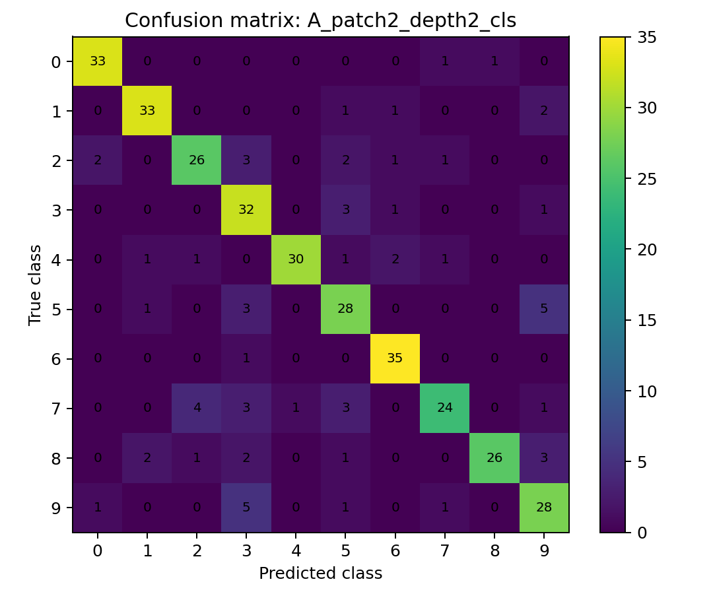
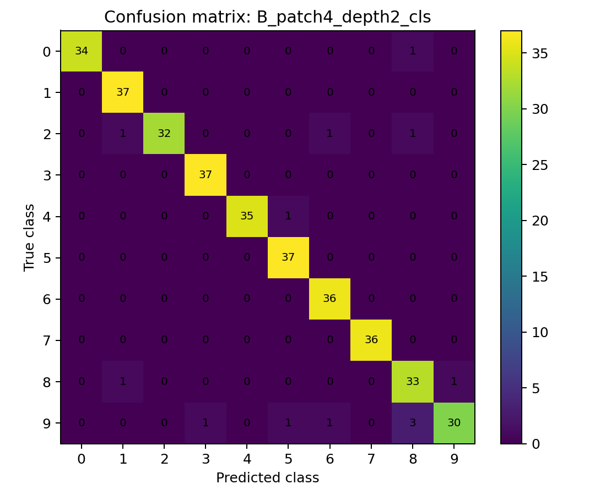
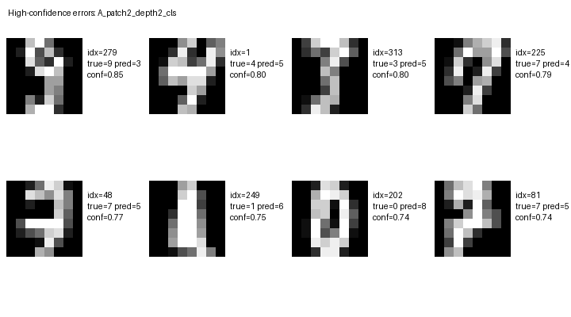
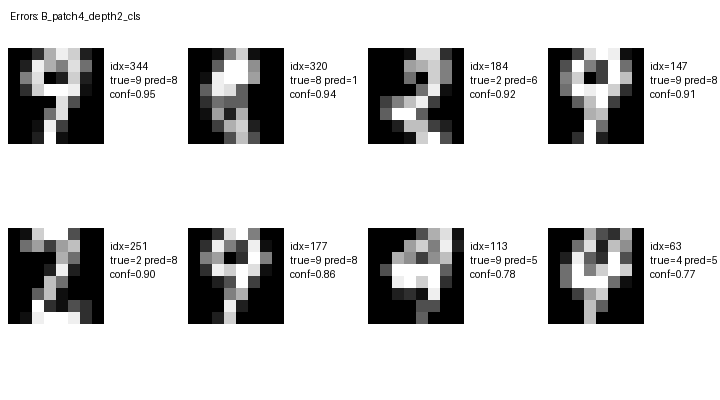
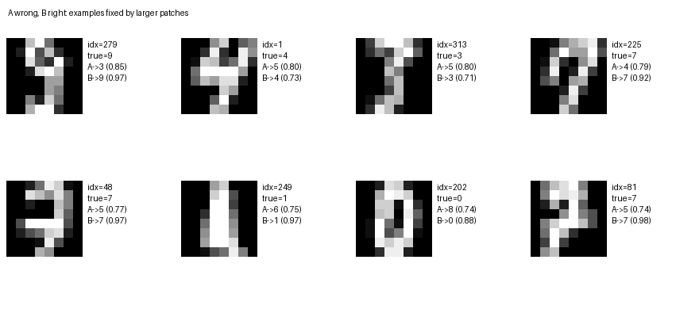
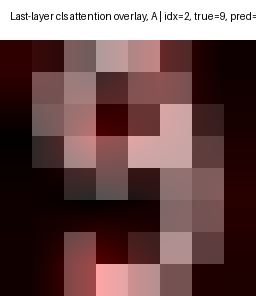
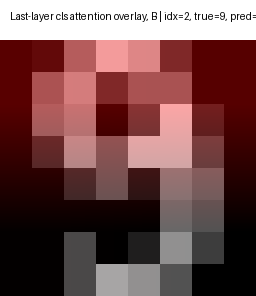

# Report: minimal Vision Transformer study on a small image dataset

## 1. Experimental setup

I used the built-in **Digits** dataset from scikit-learn as a compact 10-class image classification benchmark.  
It contains `1797` grayscale images of handwritten digits with native resolution `8x8`.

Why this choice:

- fully reproducible without external downloads;
- small enough to compare several ViT variants on CPU;
- still challenging because many digits share similar shapes.

Data split:

- train: `1078`
- validation: `359`
- test: `360`

All experiments used:

- optimizer: `AdamW`
- learning rate: `2e-3`
- training budget: `80 epochs`
- batch size: full batch (`1078`)
- embedding dimension: `32`
- heads: `4`

## 2. Patch embedding and tokenization

Patch embedding is implemented as a strided convolution:

```python
nn.Conv2d(in_channels=1, out_channels=embed_dim,
          kernel_size=patch_size, stride=patch_size)
```

This maps an image tensor `B x C x H x W` to a token sequence `B x N x D`, where:

- `N = (H / P) * (W / P)` is the number of patches,
- `P` is patch size,
- `D` is token dimension.

For the baseline **variant A**:

- image size: `8x8`;
- patch size: `2`;
- patch grid: `4x4`;
- patch tokens: `16`;
- class token: yes;
- sequence length: `N = 16 + 1 = 17`;
- token dimension: `D = 32`.

For `patch=4`:

- patch grid: `2x2`;
- patch tokens: `4`;
- sequence length: `N = 4 + 1 = 5`.

## 3. Minimal ViT architecture

Implemented modules:

1. patch embedding;
2. learnable positional embeddings;
3. optional class token;
4. `2–4` Transformer encoder blocks;
5. classification head.

Each Transformer block contains:

- `LayerNorm`;
- multi-head self-attention;
- residual connection;
- MLP with GELU;
- second residual connection.

## 4. Compared configurations

| config               |   patch_size |   depth | use_cls_token   |   embed_dim |   params |   seq_len |   val_acc |   test_acc |   train_acc |   time_sec |   attn_total_MACs |   attn_matrix_MB_per_layer_b1 |   attn_matrix_MB_all_layers_batch64 |
|:---------------------|-------------:|--------:|:----------------|------------:|---------:|----------:|----------:|-----------:|------------:|-----------:|------------------:|------------------------------:|------------------------------------:|
| B_patch4_depth2_cls  |            4 |       2 | yes             |          32 |    18218 |         5 |    0.9554 |     0.9639 |      1      |      12.05 |              3200 |                        0.0004 |                              0.0488 |
| D_patch2_depth2_mean |            2 |       2 | no              |          32 |    18154 |        16 |    0.9109 |     0.8833 |      0.9583 |      24.09 |             32768 |                        0.0039 |                              0.5    |
| C_patch2_depth4_cls  |            2 |       4 | yes             |          32 |    35306 |        17 |    0.8524 |     0.8472 |      0.9314 |      48.01 |             73984 |                        0.0044 |                              1.1289 |
| A_patch2_depth2_cls  |            2 |       2 | yes             |          32 |    18218 |        17 |    0.8635 |     0.8194 |      0.9045 |      26.43 |             36992 |                        0.0044 |                              0.5645 |

## 5. Explicit self-attention cost estimates

For self-attention, the quadratic part is dominated by the `N x N` interaction matrix.

Approximate cost per layer:

- attention compute: `~ 2 * N^2 * D` multiply-accumulate operations;
- attention matrix memory: `heads * N^2 * bytes_per_value`.

### Variant A (patch=2, depth=2, cls token)

- `N = 17`
- `D = 32`
- `heads = 4`

Per layer:

- compute: `2 * 17^2 * 32 = 18,496` MACs
- attention matrix memory at batch=1, float32:
  `4 * 17^2 * 4 bytes = 4,624 bytes ≈ 0.0044 MB`

Across 2 layers:

- total attention compute: `36,992` MACs
- attention matrix memory for batch=64 across all layers:
  `≈ 0.5645 MB`

### Variant B (patch=4, depth=2, cls token)

- `N = 5`
- `D = 32`

Across 2 layers:

- total attention compute: `3,200` MACs
- batch-64 all-layer attention matrix memory: `0.0488 MB`

So variant B is about **11.56x** cheaper in the quadratic attention part than variant A.

## 6. Main results

### 6.1 Patch size comparison

Comparing:

- **A**: `patch=2`, `depth=2`, `cls token`
- **B**: `patch=4`, `depth=2`, `cls token`

Results:

- A: test accuracy **0.8194**
- B: test accuracy **0.9639**

Observation: on this tiny `8x8` dataset, the coarser patching strategy worked better.  
A likely explanation is that the task depends more on **global occupancy pattern** than on fine local detail.  
With so few pixels, dividing the image into 16 small patches increases sequence length and attention cost, but does not introduce much extra useful information.

### 6.2 Class token vs mean pooling

Comparing:

- **A**: `patch=2`, `cls token`
- **D**: `patch=2`, `mean pooling`

Results:

- A: test accuracy **0.8194**
- D: test accuracy **0.8833**

Mean pooling was better here.  
On very short sequences and tiny datasets, an explicit learned class token can behave like an extra optimization burden, while mean pooling acts as a simple regularizer.

### 6.3 Depth comparison

Comparing:

- **A**: `patch=2`, depth `2`
- **C**: `patch=2`, depth `4`

Results:

- A: test accuracy **0.8194**
- C: test accuracy **0.8472**

Increasing depth helped somewhat, but the gain was small relative to the extra cost:

- parameters: `18,218 -> 35,306`
- total attention compute: `36,992 -> 73,984`

So deeper attention stacks can help, but here the **tokenization choice** mattered more than stacking more layers.

## 7. Error analysis

### 7.1 Baseline A (`patch=2`, depth=2, cls token)

Most frequent confusions:

- 9→3 (5), 5→9 (5), 7→2 (4), 8→9 (3), 7→5 (3)

Hardest classes by recall:

- [(7, 0.6666666666666666), (2, 0.7428571428571429), (8, 0.7428571428571429)]

Interpretation:

- `9` and `3` are confused when the upper loop is clear but the lower stroke is weak.
- `5` and `9` can overlap when the left vertical stroke is faint.
- `7` suffers when the diagonal and top bar are fragmented across small patches.

### 7.2 Best model B (`patch=4`, depth=2, cls token)

Most frequent confusions:

- 9→8 (3), 9→6 (1), 9→5 (1), 9→3 (1), 8→9 (1)

Hardest classes by recall:

- [(9, 0.8333333333333334), (2, 0.9142857142857143), (8, 0.9428571428571428)]

Interpretation:

- Errors are fewer and more concentrated.
- Remaining mistakes often involve `9`, `8`, and sometimes `6`, where global mass layout is similar.
- The model seems robust to many local stroke variations, but still fails when the coarse `2x2` occupancy pattern is ambiguous.

### 7.3 What patch size changed qualitatively

The figure `figures/a_wrong_b_right_examples.png` shows examples where A fails but B succeeds.  
Typical pattern: B preserves the overall silhouette and loop placement, while A reacts too strongly to local stroke thickness and broken segments.

This is consistent with the measured attention cost:

- A has longer sequences and therefore more pairwise token interactions,
- but on very small images that extra flexibility is not always useful.

## 8. Architectural discussion

### When the flat token scheme is convenient

A plain ViT-style tokenization is attractive when:

- the data pipeline should stay simple;
- one wants a clean separation between patch extraction and global reasoning;
- it is important to vary patch size, token dimension, pooling strategy, and depth independently;
- interpretability through token interactions is desirable.

### When its limitations become visible

The limitations show up when:

- the image is extremely small, so extra patch granularity mostly increases cost;
- the dataset is small, so a fully attention-based model can overfit or optimize unstably;
- local inductive bias matters, but the model only sees a flat patch sequence;
- precise local geometry must be preserved, yet patch boundaries break it.

This experiment highlights a key point: **the best tokenization depends strongly on image scale**.  
On small low-resolution digits, a coarse sequence with only a few tokens can outperform a finer one, because the useful signal is mostly global.

## 9. Figures

### Tokenization





### Validation curves



### Confusion matrices





### Characteristic errors







### Optional attention maps





## 10. Conclusion

The main conclusions are:

1. **Patch size was the strongest design choice** on this dataset.
2. **Coarser tokenization (`patch=4`) won both in accuracy and efficiency**.
3. **Mean pooling outperformed class token** under `patch=2`.
4. **Deeper models helped less than choosing the right tokenization**.
5. The flat ViT token scheme is elegant and easy to vary, but on very small images its lack of local bias becomes noticeable.
